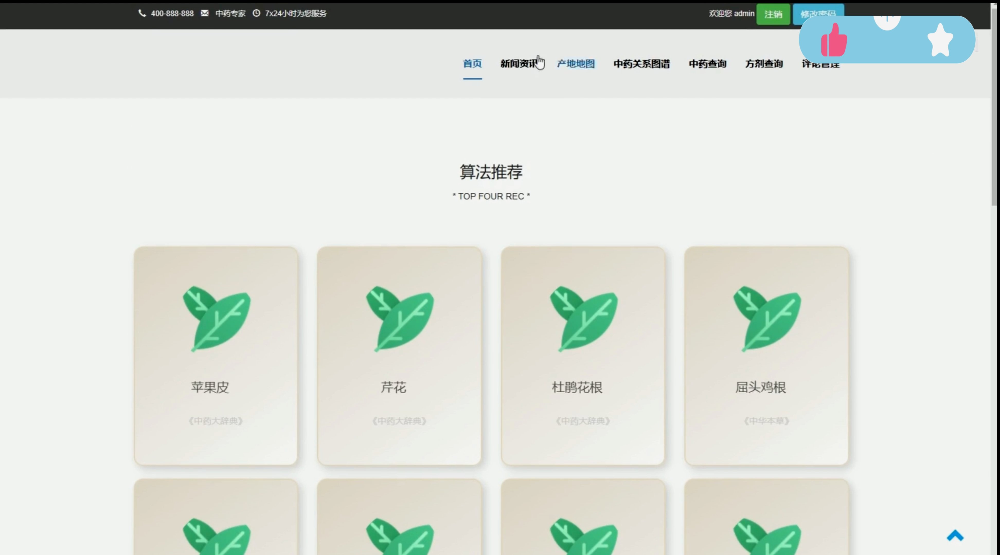

## 计算机毕业设计Spark+大模型知识图谱中药推荐系统 中药数据分析可视化大屏 中药爬虫 机器学习 中药预测系统 中药情感分析 大数据毕业设计

## 要求
### 源码有偿！一套(论文 PPT 源码+sql脚本+教程)

### 
### 加好友前帮忙start一下，并备注github有偿大模型中药推荐
### 我的QQ号是2827724252或者798059319或者 1679232425 或者 微信: 或bysj1688

# 

### 加qq好友说明（被部分 网友整得心力交瘁）：
    1.加好友务必按照格式备注
    2.避免浪费各自的时间！
    3.当“客服”不容易，repo 主是体面人，不爆粗，性格好，文明人。
## 功能介绍
网站端：neo4j知识图谱+推荐算法、药方查询（带图谱）、中药查询，数据下钻、产地地图、数据纠错，中医中药资讯新闻
管理端：药方、药材、资讯、用户的增删改查管理等
大屏端：超酷知识图库结合可视化
架构： 3+1+2架构 三前端一后端双数据库
技术：vue+springboot+neo4j+mysql+spark （java开发为主）
数据来源：包含scrapy爬虫，数据预处理，图谱生成

## 演示视频
https://www.bilibili.com/video/BV1YtDwYFEtJ/?spm_id_from=333.999.0.0

## 演示截图

